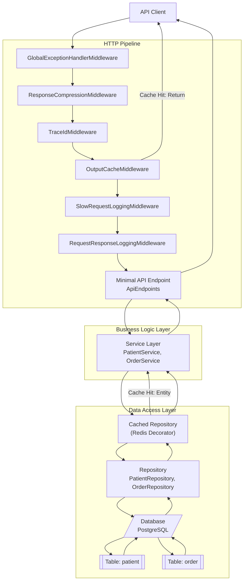

# Example API - Multi-Language Implementation

- 這是一個展示如何用不同程式語言實作相同 API 規格的專案，涵蓋 C# ASP.NET Core、Node.js Express 和 Python FastAPI 三種實作。
- 希望可以提供一種基本簡易的程式架構範例，讓開發者能夠參考不同語言的實作方式與架構設計，而不是都使用「義大利麵式」一條龍的寫法寫出可閱讀性低、不語意化、不可維護、不可測試的 Web API 專案。
- 三種程式語言的實作目前都採用 3-Layer 的程式架構，暫時不採用 DDD 或 CQRS 的架構，目的是希望 Keep it simple, keep it stupid. (KISS)。
- 建議開發人員寫出 intention-level 的程式碼，而不是 code-level 的「代碼」。
  - C# 是高度現代化的高階程式語言，**讓「意圖」(What) 清晰才是重點，而不是「怎麼實作」(How)**。
  - 只有語意化的程式碼才是高品質、高質量、高可閱讀性、高可維護性、高可擴出性、高可測試性的程式碼，即便要應付高併發與大流量的程式碼，仍應該要「語意化」。
  - 如果你的程式碼與程式架構不能讓只有 1 年工作經驗的人看得懂，代表你的程式碼品質就是 code-level 的代碼。
  - 如果你的程式碼停留在 code-level 代碼階段，基本上你也不用去考慮 DDD、CQRS 或者 Clean Architecture 了，**因為你完全不了解什麼叫做「程式設計」、「軟體開發工程」、「協作開發」的重要性和最基礎的 OOP (物件導向)**。
  - 要寫出能動的「代碼」此專案就沒有任何參考價值。
- 本專案不包含任何前端相關技術，單純的示範後端 API 的實作方式，非常適合應用於前後端分離並且採用容器化 Microservices 架構的專案。

## 📁 Git Repository 結構

```
example-api/
├── src/
│   ├── csharp/                     # C# ASP.NET Core 實作
│   ├── nodejs/                     # Node.js + Express + TypeScript 實作
│   └── python/                     # Python + FastAPI 實作
├── docker/
│   ├── pg-docker-compose.yml       # PostgreSQL 資料庫 compose 檔
│   ├── api-docker-compose.yml      # API 服務 compose 檔
│   ├── dockerfile                  # API Docker 映像檔
│   └── dockerfile.alpine           # Alpine 版本 Docker 映像檔
├── db/                             # PostgreSQL 資料目錄（本機開發用）
├── .env                            # 環境變數設定
├── .env.example                    # 環境變數範例
├── api.http                        # REST Client 測試檔案
├── run-csharp.sh                   # 啟動 C# API 腳本
├── run-nodejs.sh                   # 啟動 Node.js API 腳本
└── stop-csharp.sh                  # 停止 C# API 腳本
```

---

## 🏗️ 專案結構說明

### C# ASP.NET Core 實作

```
src/csharp/
├── jjyy-example-api.sln           # Solution 檔案
└── api/
    ├── api.csproj                 # 專案檔
    ├── Program.cs                 # 應用程式進入點
    ├── Controllers/               # API 控制器
    ├── Services/                  # 業務邏輯層
    ├── Repositories/              # 資料存取層
    │   └── Caches/                # Redis 快取裝飾器
    ├── Models/                    # 資料模型 (Entities)
    ├── Dtos/                      # 資料傳輸物件
    │   ├── Requests/              # 請求 DTO
    │   └── Responses/             # 回應 DTO
    ├── Mappers/                   # Entity ↔ DTO 映射
    ├── Data/                      # EF Core DbContext
    ├── Migrations/                # EF Core 資料庫遷移檔
    ├── Infrastructure/            # 基礎設施 (UnitOfWork Pattern & DbSession abstraction)
    ├── DateTimeOffsetProviders/   # 時間提供者
    ├── Enums/                     # 列舉定義
    └── Validators/                # 資料驗證器
```

### Node.js Express 實作

```
src/nodejs/
├── package.json                   # npm 套件設定
├── tsconfig.json                  # TypeScript 設定
├── eslint.config.js               # ESLint 設定
└── src/
    ├── server.ts                  # 應用程式進入點
    ├── routes/                    # API 路由
    ├── services/                  # 業務邏輯層
    ├── repositories/              # 資料存取層
    │   └── caches/                # Redis 快取裝飾器
    ├── entities/                  # 資料模型 (Entities)
    ├── dtos/                      # 資料傳輸物件
    │   ├── requests/              # 請求 DTO
    │   └── responses/             # 回應 DTO
    ├── database/                  # 資料庫連線設定
    ├── cache/                     # Redis 快取設定
    ├── validators/                # 資料驗證器
    ├── middlewares/               # 中介軟體
    └── utils/                     # 工具函式
```

### Python FastAPI 實作

```
src/python/
├── requirements.txt               # pip 套件清單
├── pyproject.toml                 # Python 專案設定
├── main.py                        # 應用程式進入點
└── app/
    ├── configs/                   # 設定檔
    │   ├── database_config.py     # 資料庫設定
    │   └── cache_config.py        # Redis 快取設定
    ├── infrastructure/            # 基礎設施層
    │   ├── database.py            # 資料庫連線
    │   └── redis_client.py        # Redis 客戶端
    ├── routers/                   # API 路由
    ├── services/                  # 業務邏輯層
    ├── repositories/              # 資料存取層
    │   └── caches/                # Redis 快取裝飾器
    ├── entities/                  # 資料模型 (Entities)
    ├── schemas/                   # Pydantic Schema
    │   ├── requests/              # 請求 Schema
    │   ├── responses/             # 回應 Schema
    │   └── dtos/                  # DTO Schema
    └── validators/                # 資料驗證器
```

---

## 🎯 API 功能

### Patient Management (病患管理)
- `GET /api/patients` - 查詢病患列表（支援日期範圍、分頁）
- `GET /api/patients/{id}` - 查詢單一病患
- `POST /api/patients` - 新增病患

### Order Management (訂單管理)
- `GET /api/orders/{id}` - 查詢單一訂單
- `POST /api/orders` - 新增訂單
- `PUT /api/orders/{id}` - 更新訂單訊息

---

## 🐳 Docker Compose 說明

### `pg-docker-compose.yml` - PostgreSQL 資料庫
啟動 PostgreSQL 15 資料庫服務，用於所有三種語言實作的資料儲存。

```bash
# 啟動資料庫
docker-compose --env-file .env -f ./docker/pg-docker-compose.yml up -d

# 停止資料庫
docker-compose -f ./docker/pg-docker-compose.yml down
```

### `api-docker-compose.yml` - API 服務
用於容器化部署 API 服務。

---

## 📜 Shell Scripts 說明

### `run-csharp.sh`
啟動 C# ASP.NET Core API 服務。
- 自動啟動 PostgreSQL 資料庫（如果尚未啟動）
- 啟動 Redis 服務
- 執行 dotnet run
- API 預設運行於 `http://localhost:5000`
- Swagger UI: `http://localhost:5000/swagger`

### `run-nodejs.sh`
啟動 Node.js Express API 服務。
- 自動啟動 PostgreSQL 資料庫（如果尚未啟動）
- 啟動 Redis 服務
- 執行 npm run dev
- API 預設運行於 `http://localhost:5001`
- API Docs: `http://localhost:5001/swagger`

### `stop-csharp.sh`
停止 C# ASP.NET Core API 服務。

---

## 🚀 快速啟動

### C# ASP.NET Core 版本

```bash
# 啟動 API
./run-csharp.sh

# 瀏覽 Swagger 文件
open http://localhost:5000/swagger
```

詳細說明請參考：[src/csharp/README.md](src/csharp/README.md)

---

### Node.js Express 版本

```bash
# 安裝依賴
cd src/nodejs && npm install

# 啟動 API
./run-nodejs.sh

# 瀏覽 API 文件
open http://localhost:5001/swagger
```

詳細說明請參考：[src/nodejs/README.md](src/nodejs/README.md)

---

### Python FastAPI 版本

```bash
# 建立虛擬環境
cd src/python && python -m venv venv

# 啟動虛擬環境
source venv/bin/activate  # macOS/Linux
# or
venv\Scripts\activate     # Windows

# 安裝依賴
pip install -r requirements.txt

# 啟動 API
uvicorn main:app --reload --host 0.0.0.0 --port 5002

# 瀏覽 API 文件
open http://localhost:5002/swagger
```

詳細說明請參考：[src/python/README.md](src/python/README.md)

---

## 🗄️ 資料庫管理

- 本範例專案使用 PostgreSQL 作為 RDBMS 資料庫，以及 Redis 當作快取層。
- 建議可以使用 docker-compose 來快速啟動 PostgreSQL 和 Redis 服務，在 localhost 上進行開發與測試。
  - [PostgreSQL docker-compose.yml 範例](https://gitlab.com/ponylin1985/MyDockerContainers/-/blob/master/postgresql/docker-compose-15.3.yml?ref_type=heads)
  - [Redis docker-compose.yml 範例](https://gitlab.com/ponylin1985/MyDockerContainers/-/blob/master/redis/docker-compose-7.2.2-alpine3.18.yml?ref_type=heads)

### Database Migration

**重要說明：** 目前資料庫遷移（Database Migration）統一由 **C# ASP.NET Core 的 EF Core** 管理。

Node.js 和 Python 實作目前**不支援**獨立的 database migration，所有 schema 變更必須透過 C# 專案的 `dotnet ef` CLI 工具處理。<br/>
因此，請確保在進行任何資料庫 schema 變更時，皆在 C# 專案中執行 migration。

- 必要安裝軟體：
  - .NET SDK 10。
  - dotnet ef CLI 工具：`dotnet tool install --global dotnet-ef`

#### 執行 Migration (C# 專案)

```bash
cd src/csharp/api

# 新增 Migration
dotnet ef migrations add MigrationName

# 更新資料庫
dotnet ef database update

# 回滾 Migration
dotnet ef database update PreviousMigrationName
```

### 資料庫 Schema

- `patient` - 病患資料表
  - `id` (bigint, PK)
  - `name` (varchar(50))
  - `created_at` (timestamptz)
  - `updated_at` (timestamptz)

- `order` - 訂單資料表
  - `id` (bigint, PK)
  - `patient_id` (bigint, FK → patient.id)
  - `message` (varchar(500))
  - `created_at` (timestamptz)
  - `updated_at` (timestamptz)

---

## 🔧 技術棧比較

| 功能      | C# ASP.NET Core                                                                              | Node.js Express              | Python FastAPI             |
| --------- | -------------------------------------------------------------------------------------------- | ---------------------------- | -------------------------- |
| Web 框架  | ASP.NET Core 10                                                                              | Express 5 + TypeScript       | FastAPI 0.115              |
| ORM       | Entity Framework Core + Dapper                                                               | TypeORM                      | SQLAlchemy 2.0 (Async)     |
| 資料驗證  | IValidatableObject (ASP.NET Core 內建)                                                       | class-validator              | Pydantic                   |
| 快取      | StackExchange.Redis (IDistributedCache)<br/>CacheOutput (Microsoft.AspNetCore.OutputCaching) | Redis (ioredis)              | Redis (redis.asyncio)      |
| API 文件  | Swagger (Swashbuckle)                                                                        | Swagger (swagger-ui-express) | OpenAPI (FastAPI built-in) |
| 日誌      | Serilog + ILogger (Microsoft.Extensions.Logging)                                             | Winston                      | Python logging             |
| 彈性機制  | Polly (Retry, Circuit Breaker)                                                               | 自行實作 (Retry)             | -                          |
| Migration | EF Core Migrations                                                                           | ❌ 不支援                     | ❌ 不支援                   |

### Node.js 彈性機制實作範例

#### Retry Pattern (重試機制)

```typescript
// utils/retry.ts
export async function withRetry<T>(
  fn: () => Promise<T>,
  maxRetries: number = 3,
  delayMs: number = 1000
): Promise<T> {
  let lastError: Error;

  for (let attempt = 1; attempt <= maxRetries; attempt++) {
    try {
      return await fn();
    } catch (error) {
      lastError = error as Error;
      if (attempt < maxRetries) {
        await new Promise(resolve => setTimeout(resolve, delayMs * attempt));
      }
    }
  }

  throw lastError!;
}

// 使用範例
const result = await withRetry(
  () => externalApiCall(),
  3,  // 最多重試 3 次
  1000 // 延遲 1 秒
);
```

#### Circuit Breaker Pattern (斷路器機制)

```typescript
// utils/circuitBreaker.ts
export class CircuitBreaker {
  private failureCount = 0;
  private lastFailureTime?: number;
  private state: 'CLOSED' | 'OPEN' | 'HALF_OPEN' = 'CLOSED';

  constructor(
    private failureThreshold: number = 5,
    private resetTimeoutMs: number = 60000
  ) {}

  async execute<T>(fn: () => Promise<T>): Promise<T> {
    if (this.state === 'OPEN') {
      if (Date.now() - this.lastFailureTime! > this.resetTimeoutMs) {
        this.state = 'HALF_OPEN';
      } else {
        throw new Error('Circuit breaker is OPEN');
      }
    }

    try {
      const result = await fn();
      this.onSuccess();
      return result;
    } catch (error) {
      this.onFailure();
      throw error;
    }
  }

  private onSuccess() {
    this.failureCount = 0;
    this.state = 'CLOSED';
  }

  private onFailure() {
    this.failureCount++;
    this.lastFailureTime = Date.now();
    if (this.failureCount >= this.failureThreshold) {
      this.state = 'OPEN';
    }
  }
}

// 使用範例
const breaker = new CircuitBreaker(5, 60000);
const result = await breaker.execute(() => externalApiCall());
```

---

## 🧪 測試 API

- 專案根目錄包含 `api.http` 檔案，可使用 REST Client (VS Code Extension) 或類似工具進行 API 測試。
- 弱者使用各個語言實作的出來的 `GET /swagger` 頁面進行測試。

```http
### Get Patients
GET http://localhost:5000/api/patients?startTime=2020-01-01T00:00:00Z&endTime=2026-12-31T23:59:59Z&pageNumber=1&pageSize=10

### Create Patient
POST http://localhost:5000/api/patients
Content-Type: application/json

{
  "name": "John Doe"
}
```

---

## 📦 環境變數設定

複製 `.env.example` 為 `.env` 並設定以下變數：

```bash
# PostgreSQL
POSTGRES_USER=your_user
POSTGRES_PASSWORD=your_password

# Redis
REDIS_HOST=localhost
REDIS_PORT=6379
REDIS_DB=0
REDIS_PASSWORD=your_redis_password

# Node.js
NODE_EXPRESS_PORT=5001

# Cache
CACHE_SLIDING_EXPIRATION_MINUTES=10
CACHE_ABSOLUTE_EXPIRATION_MINUTES=60

# Logging
LOG_LEVEL=debug
LOG_REQUEST_BODY=true
LOG_RESPONSE_BODY=true
```

---

## 🏛️ 架構特色

### 分層架構流程

- 主要為 3-Layer 架構 (Presentation Layer/Business Logic Layer/Data Access Layer)，透過 ASP.NET Core 內建的 Output Caching 和 Redis 快取裝飾器 (Decorator Pattern) 以提升效能。
- 目前 Entity 主要為貧血模型 (Anemic Model)，業務邏輯集中在 Service 層，適合中小型業務邏輯不複雜的專案，未來可能再提供以 DDD 架構的範例。
- 整體流程如下：

```
Router/ApiEndpoint/Controller
    ↓
Http Output Cache Middleware
    ↓
Service (Business Logic)
    ↓
Cached Repository (Decorator)
    ↓
Repository (Data Access)
    ↓
Database
```

- 下圖為整體架構流程圖：



### 目錄結構範例 (以 C# ASP.NET Core 的 Patient 與 Order 為例)

```
ApiEndpoints/                         ← Minimal APIs 端點
├── PatientApiEndpoints
└── OrderApiEndpoints

Services/                             ← 業務邏輯 (目前為 Application Service 與 Domain Service 混合)
├── PatientService
└── OrderService

Repositories/                         ← 資料倉儲抽象
├── PatientRepository
└── OrderRepository

Mappers/                              ← 資料載體對應
├── OrderMapper
└── PatientMapper

Middlewares/                          ← Http 管道中介層
├── GlobalExceptionHandlerMiddleware
├── RequestResponseLoggingMiddleware
├── SlowRequestLoggingMiddleware
└── TraceIdMiddleware

Models/                               ← 貧血模型 (Entities/POCOs)
├── Patient
└── Order

Migrations/                           ← 資料庫遷移
├── XxxMigration.cs
├── YyyMigration.cs
└── DbContextModelSnapshot

Dtos/                                 ← 資料傳輸物件 (Data Transfer Objects)
├── PatientDto
├── OrderDto
└── Requests                          ← 請求資料載體 (Request DTOs)
    ├── CreateOrderRequest
    ├── CreatePatientRequest
    ├── GetPatientsRequest
    ├── UpdateOrderMessageRequest
    └── PagedRequest
└── Responses                         ← 回應資料載體 (Response DTOs)
    ├── ApiResult
    └── PagedResult

Options/                              ← 應用程式設定組態
└── RequestResponseLoggingOptions

Validators/                           ← 請求資料驗證器
└── SanitizerValidator
```

### 共同架構模式
- **Repository Pattern** - 資料倉儲抽象化
- **Unit of Work Pattern & IDbSession** - 交易管理與資料存取抽象化，並且透過 Polly 實現 Retry & Circuit Breaker (only for C# ASP.NET Core)
- **Service Layer** - 業務邏輯封裝
- **DTO Pattern** - 資料傳輸物件分離
- **Dependency Injection** - 依賴注入
- **Decorator Pattern** - Redis 快取裝飾器

### 快取策略
- **Cache-Aside Pattern** - 查詢時先檢查快取 (Http Output Caching + Redis Cache)
- **Write-Through** - 更新時同步清除快取 (Http Output Caching + Redis Cache)
- **Decorator Pattern** - 透過裝飾器添加 Redis 快取功能，不影響原有 Repository

### Make Your Production Code Like BDD Style

- BDD (Behavior-Driven Development) 強調以行為為導向的開發方式，讓程式碼更具可讀性和可維護性。
  - Given (前置條件)
  - When (行為/動作)
  - Then (結果/期望)
- 最重要的兩點: 
  - **讓程式碼的「意圖」(What - Happy Path) 清晰，而不是「怎麼實作」(How)**。
  - 不要只有在寫 Unit Test 時才使用 BDD 風格，**在撰寫生產程式碼時也應該採用 BDD 風格**，讓程式碼更具可讀性和可維護性。
- 範例: [src/csharp/api/Services/PatientService.cs AddPatientAsync 方法](src/csharp/api/Services/PatientService.cs)

```csharp
public async Task<ApiResult<PatientDto>> AddPatientAsync(CreatePatientRequest request)
{
    // BDD Style: Given (Guard Clauses)
    var patient = MapToEntity(request);
    await EnsureEmailUniqueAsync();
    await EnsurePhoneNumberUniqueAsync();
    await EnsurePrescriptionValidAsync();

    // BDD Style: When (Action)
    var createdPatient = await _patientRepository.AddAsync(patient);
    await _unitOfWork.SaveChangesAsync();

    // BDD Style: Then (Assertions)
    ShouldCreatedSuccessfully();
    return SuccessResult(createdPatient.ToDto());
}
```

- 或者至少類似以下的範例

```csharp
public async Task<ApiResult<PatientDto>> AddPatientAsync(CreatePatientRequest request)
{
    var patient = MapToEntity(request);
    
    // Guard Clauses
    if (!await IsEmailDuplicatedAsync())
    {
        _logger.LogWarning("Email {Email} is already in use.", patient.Email);
        return FailureResult<PatientDto>(ApiCode.OperationFailed, "Email is already in use.");
    }

    // Guard Clauses
    if (!await IsPhoneNumberDuplicatedAsync())
    {
        _logger.LogWarning("Phone number {PhoneNumber} is already in use.", patient.PhoneNumber);
        return FailureResult<PatientDto>(ApiCode.OperationFailed, "Phone number is already in use.");
    }

    // Guard Clauses
    if (!await IsPrescriptionValidAsync())
    {
        _logger.LogWarning("One or more prescriptions have invalid medication IDs.");
        return FailureResult<PatientDto>(
            ApiCode.OperationFailed, "One or more prescriptions have invalid medication IDs.");
    }

    // When (Action)
    var createdPatient = await _patientRepository.AddAsync(patient);
    await _unitOfWork.SaveChangesAsync();

    // Then (Assertions)
    if (!IsCreatedSuccessfully())
    {
        _logger.LogError("Failed to create patient: {Patient}", patient);
        return FailureResult<PatientDto>(ApiCode.OperationFailed, "Failed to create patient.");
    }

    return SuccessResult(createdPatient.ToDto());
}
```

- 現代的程式碼寫作風格繁多，OOP、Functional Programming、Fluent Style、BDD Style、DDD 等等，每種各有其優缺點，你可以自行挑選一種習慣的風格來撰寫。
- 但最重要的是撰寫出**邏輯正確、高效能、高可讀性易於讓「其他人」看得懂，維護得動的程式碼**，而不是只有你自己看得懂的程式碼。

---

## 📝 開發備註

- 這是一個學習/比較用途的專案
- 三個版本實作相同的 API 規格和架構模式
- 可用於對照不同語言/框架的實作方式
- 資料庫 Migration 統一由 C# EF Core 管理
- 所有實作共用同一個 PostgreSQL 資料庫和 Redis 服務

---

## 🤝 貢獻

歡迎提出 Issue 或 Pull Request！

## 📄 授權

MIT License
